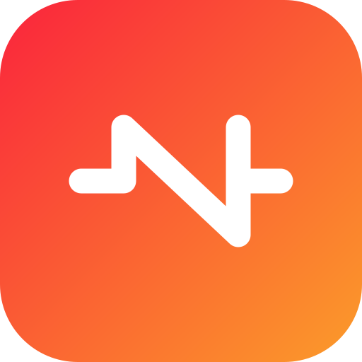
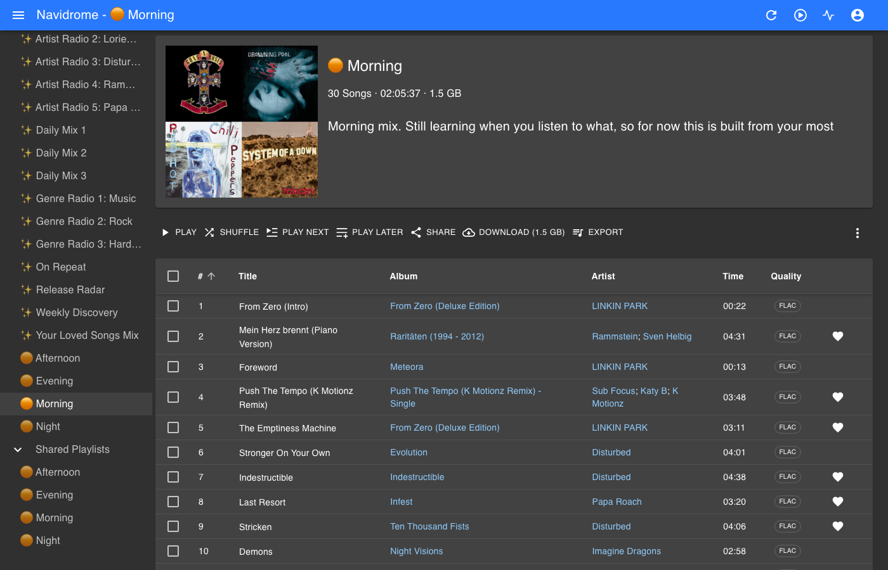
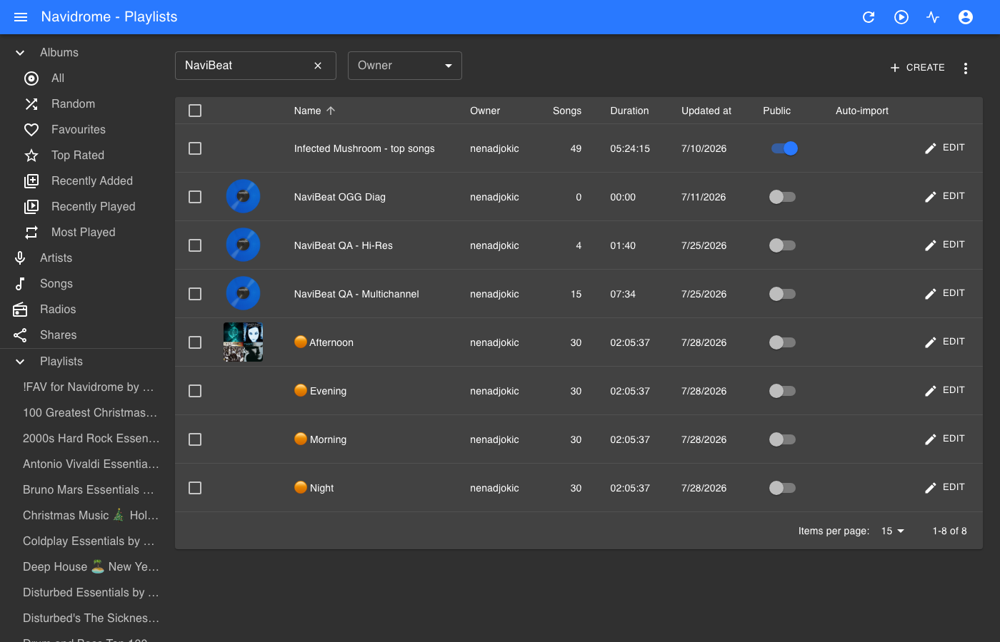

<p align="center">
  <a href="https://navibeat.app"></a>
</p>

<h1 align="center">NaviBeat Mixes</h1>

<p align="center">
  <a href="https://navibeat.app"><b>navibeat.app</b></a>
</p>

[](../../releases)
[](../../releases/latest)
[](https://www.navidrome.org)
[](LICENSE)

[](https://buymeacoffee.com/nenadjokic)
[](https://paypal.me/nenadjokicRS)

A Navidrome plugin that builds playlists from how you actually listen: a mix
for each part of the day, and a Rediscover mix of music you loved and have not
played in months.

It creates ordinary playlists through the Subsonic API, so they appear in
**every** client you use. The Navidrome web UI, Symfonium, Amperfy, play:Sub,
NaviBeat, anything else. Nothing to install on the client side.



## What you get

| Playlist | What is in it |
|---|---|
| 🟠 Morning | What you play between 05:00 and 11:00 |
| 🟠 Afternoon | 11:00 to 17:00 |
| 🟠 Evening | 17:00 to 23:00 |
| 🟠 Night | 23:00 to 05:00 |
| 🟠 Rediscover | Starred or often-played music you have not touched in months |
| 🟠 Wrapped 2026 | Your most played, since the plugin was installed |

Names and the prefix are configurable. They are fixed per mix and never change
with their contents, so you get a set of playlists that stays the same set
rather than a new one appearing every week.



They are created **private**, so on a shared server nobody else sees your mixes.

## Honest about what it knows

**Rediscover works the day you install it.** Navidrome already tracks what you
starred and when you last played each track, so there is nothing to wait for.

**The time-of-day mixes need a few weeks.** This is not a limitation anyone
chose. The Subsonic API exposes only a track's *last* play, never the
individual plays, so there is no way to ask a server what you listen to at
08:00. The plugin has to watch plays go past and build that picture itself.

Until it has enough (150 plays by default), the mixes are built from your most
played music instead, and **each playlist says so in its own description**:

> Morning mix. Still learning when you listen to what, so for now this is built
> from your most played music. It gets more personal over the next few weeks.

Once there is enough, the same playlist changes to:

> Morning mix, built from what you actually play at this time of day. Refreshes daily.

You never have to guess which one you are looking at.

## Privacy

Your listening history lives in Navidrome's own key-value store and is never
sent anywhere. Nothing leaves your machine unless you switch on Wrapped
sharing, which is **off by default**.

If you do switch it on, exactly one thing is sent, to `navibeat.app` and
nowhere else: your play total, distinct track count, top artist names and your
peak listening hour. Never a play log, never track ids, never your username,
and nothing that identifies your server. It is one short file you can read
before trusting it: [`internal/wrapped/share.go`](internal/wrapped/share.go),
and a test fails the build if any other field ever appears in that payload.

## Requirements

- Navidrome **0.63.1 or newer**, with plugins enabled
- Nothing else

## Install

1. Download `navibeat-mixes.ndp` from [the latest release](../../releases/latest).
2. Drop it into your Navidrome plugins folder.
3. Enable plugins in `navidrome.toml` if you have not already:

   ```toml
   [Plugins]
   Enabled = true
   ```

4. Restart Navidrome, then approve the plugin in **Settings, Plugins**. It asks
   for four permissions:

   | Permission | Why |
   |---|---|
   | `scheduler` | To refresh your mixes daily |
   | `subsonicapi` | To read your library and create the playlists |
   | `users` | Mixes are per user, and every Subsonic call needs a user |
   | `kvstore` | To remember when you listen to what |

Your mixes appear within a minute of approving it, and refresh at 04:00 daily.

> **If nothing appears after an upgrade:** Navidrome disables a plugin whenever
> its file changes, because the new version may ask for different permissions.
> Approve it again in Settings.

## Configuration

**Everything is a form field in Navidrome's own plugin settings.** No config
files, no restart. Five groups:

| Group | What you can change |
|---|---|
| Playlists | The name prefix and how many tracks each mix holds |
| Which mixes to build | A switch per mix, so you can turn off any you do not want |
| Names | Rename any mix, so they can speak your language |
| Tuning | Rediscover age, how soon mixes become time-aware, genre filtering |
| Sharing | Wrapped sharing, off by default |

Every field has a default that works on a server nobody has touched, so you can
install it and never open the settings at all.

**If Rediscover comes out empty**, your listening is simply too current for it:
nothing you starred has gone six months untouched. Lower the Rediscover age to
2 or 3 months.

**A mix needs at least 10 tracks to be worth making**, so an account with very
little listening history gets no playlists rather than a four track one.

### Why the genre threshold exists

Tagging tools sometimes write a single genre across an entire library. One real
collection had one genre on 15316 of its 15520 tracks. Selecting on a genre
like that is indistinguishable from selecting at random, so any genre covering
more than `genreNoiseThreshold` of your library is ignored as a signal. Your
files are never modified.

## Building from source

```bash
make          # produces navibeat-mixes.ndp
make test     # unit tests, run natively
```

Both toolchains work and the Makefile picks whichever you have. TinyGo is worth
installing, it more than halves the binary that ships to every user:

| Toolchain | Size |
|---|---|
| TinyGo | **1.5 MB** |
| Standard Go | 3.9 MB |

## Development

You need a scratch Navidrome. **Never point this at a server you care about.**

```bash
make          # build the .ndp
dev/up.sh     # throwaway Navidrome on port 4544, plugin installed and enabled
dev/verify.sh # assert the plugin loaded and did its job
```

Three things about the dev loop that are easy to lose an hour to:

1. **A discovered plugin is not an enabled plugin.** Navidrome writes it to the
   database with `enabled=0` and waits for you to approve its permissions.
2. **It disables itself again on every file change**, and the approval only
   sticks if you set it *after* the server has recorded the new file's hash.
   Approve after the restart, not before.
3. **Do database edits with `docker exec`, inside the container.** Editing the
   SQLite file from the host while the server has it open made the server
   report `database disk image is malformed`.

A fresh Navidrome has no listening history, so seed some:

```bash
docker exec -u root nd-dev sqlite3 /data/navidrome.db \
  "INSERT OR REPLACE INTO annotation (user_id, item_id, item_type, play_count, play_date, starred, starred_at)
   SELECT (select id from user limit 1), id, 'media_file', 6,
          datetime('now','-8 months'), 1, datetime('now','-8 months')
   FROM media_file ORDER BY id LIMIT 25;"
```

## How clients can recognise these playlists

A Navidrome plugin cannot serve HTTP, register a route, or draw any UI. The
only surface it has is the playlists it creates, so each description carries
the sentence a person reads, one line of attribution, and one machine line:

```
Morning mix, built from what you actually play at this time of day. Refreshes daily.
Made by NaviBeat  ·  navibeat.app
nb1:timeofday:morning:2026-07-28:affinity:30
```

Machine line fields, colon separated: schema version, kind, slot, generation
date, mode, track count.

Clients that know nothing about this show two short extra lines, which is
harmless. Clients that do understand it can hide the machine line and render
something richer.

The order is deliberate. `playlist.comment` is declared `varchar(255)` in the
schema and simply is not enforced today. If that ever changes, truncation eats
from the end, taking the machine tail first and leaving a description a person
can still read.

If you are writing a client: key your detection on the `nb1:` line, never on
the playlist name, because the prefix is user-configurable. Treat anything
malformed or truncated as "not mine" so you never restyle a playlist somebody
made by hand.

## Support

This plugin is free and always will be. If it earns you a few good mornings:

[](https://buymeacoffee.com/nenadjokic)

[](https://paypal.me/nenadjokicRS)

## About NaviBeat

NaviBeat is a music player for your own Navidrome or OpenSubsonic server, on
iPhone, iPad, Mac, Apple TV, Apple Watch and Linux. This plugin is a separate,
free, open-source project that works with every client, not just that one.

[navibeat.app](https://navibeat.app)

## Licence

**GPL-3.0-or-later**, the same licence as Navidrome itself.

This is not a preference, it follows from how the plugin is built: it links
Navidrome's own Go plugin development kit into the compiled `plugin.wasm`, and
Navidrome is GPL-3.0. Distributing that binary therefore means distributing
GPL-3.0 code, so the whole plugin is GPL-3.0.

It also happens to be the right choice. It matches the project it extends, it
is the licence the self-hosted community expects, and it guarantees that anyone
who ships a modified version of this plugin has to publish their changes.

Nothing here restricts any music player that merely reads the playlists it
creates. Reading a playlist over the Subsonic API is two separate programs
talking over a network protocol, not a derived work.
