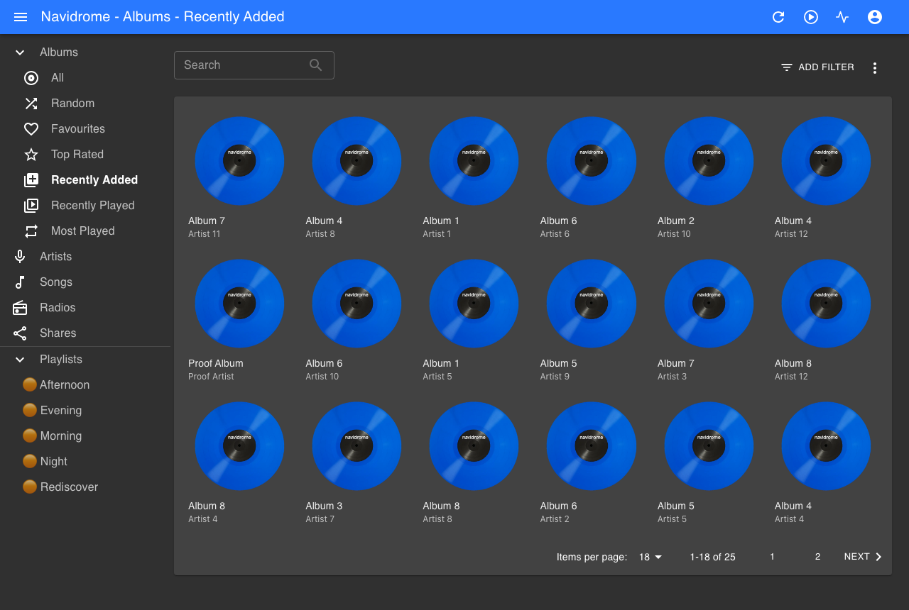
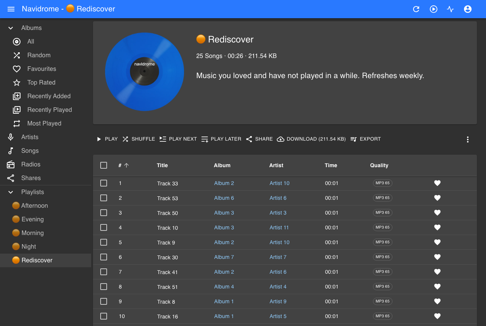

# NaviBeat Mixes

A Navidrome plugin that builds playlists from how you actually listen: a mix
for each part of the day, and a Rediscover mix of music you loved and have not
played in months.

It creates ordinary playlists through the Subsonic API, so they appear in
**every** client you use. The Navidrome web UI, Symfonium, Amperfy, play:Sub,
NaviBeat, anything else. Nothing to install on the client side.



## What you get

| Playlist | What is in it |
|---|---|
| 🟠 Morning | What you play between 05:00 and 11:00 |
| 🟠 Afternoon | 11:00 to 17:00 |
| 🟠 Evening | 17:00 to 23:00 |
| 🟠 Night | 23:00 to 05:00 |
| 🟠 Rediscover | Starred or often-played music you have not touched in months |

Names and the prefix are configurable. They are fixed per mix and never change
with their contents, so you get five playlists that stay five playlists rather
than a new one every week.



## Honest about what it knows

**Rediscover works the day you install it.** Navidrome already tracks what you
starred and when you last played each track, so there is nothing to wait for.

**The time-of-day mixes need a few weeks.** This is not a limitation anyone
chose. The Subsonic API exposes only a track's *last* play, never the
individual plays, so there is no way to ask a server what you listen to at
08:00. The plugin has to watch plays go past and build that picture itself.

Until it has enough (150 plays by default), the mixes are built from your most
played music instead, and **each playlist says so in its own description**:

> Morning mix. Still learning when you listen to what, so for now this is built
> from your most played music. It gets more personal over the next few weeks.

Once there is enough, the same playlist changes to:

> Morning mix, built from what you actually play at this time of day. Refreshes daily.

You never have to guess which one you are looking at.

## Privacy

Everything stays on your server. The plugin asks for no network permission and
cannot reach the internet even if it wanted to. Your listening history is kept
in Navidrome's own key-value store and is never sent anywhere.

## Requirements

- Navidrome **0.63.1 or newer**, with plugins enabled
- Nothing else

## Install

1. Download `navibeat-mixes.ndp` from the releases page.
2. Drop it into your Navidrome plugins folder.
3. Enable plugins in `navidrome.toml` if you have not already:

   ```toml
   [Plugins]
   Enabled = true
   ```

4. Restart Navidrome, then approve the plugin in **Settings, Plugins**. It asks
   for four permissions:

   | Permission | Why |
   |---|---|
   | `scheduler` | To refresh your mixes daily |
   | `subsonicapi` | To read your library and create the playlists |
   | `users` | Mixes are per user, and every Subsonic call needs a user |
   | `kvstore` | To remember when you listen to what |

Your mixes appear within a minute of approving it, and refresh at 04:00 daily.

## Configuration

Everything is optional. The defaults are chosen to work on a server nobody has
configured.

| Key | Default | What it does |
|---|---|---|
| `prefix` | `🟠 ` | Goes in front of every playlist name |
| `mixSize` | `30` | Tracks per mix |
| `rediscoverMonths` | `6` | How long ago counts as forgotten |
| `minEventsForAffinity` | `150` | Plays needed before mixes become time-aware |
| `genreDenylist` | `Music,Musik,Musique` | Genres to ignore, comma separated |
| `genreNoiseThreshold` | `0.6` | Ignore any genre covering more of the library than this |
| `enabledMixes` | all | Comma separated: `morning,afternoon,evening,night,rediscover` |
| `name.morning` | `Morning` | Rename a mix, one key per slot |

### Why the genre threshold exists

Tagging tools sometimes write a single genre across an entire library. One real
collection had one genre on 15316 of its 15520 tracks. Selecting on a genre
like that is indistinguishable from selecting at random, so any genre covering
more than `genreNoiseThreshold` of your library is ignored as a signal. Your
files are never modified.

## Building from source

```bash
make          # produces navibeat-mixes.ndp
make test     # unit tests, run natively
```

Both toolchains work, and the Makefile picks whichever you have:

| Toolchain | Command | Size |
|---|---|---|
| TinyGo (preferred) | `tinygo build -target wasip1 -buildmode=c-shared` | smaller |
| Standard Go | `GOOS=wasip1 GOARCH=wasm go build -buildmode=c-shared` | 3.9 MB |

Navidrome's documentation says TinyGo is required. Its own example Makefile
carries both paths, and standard Go is what this build is verified with.

## Development

You need a scratch Navidrome. **Never point this at a server you care about.**

```bash
make          # build the .ndp
dev/up.sh     # throwaway Navidrome on port 4544, plugin installed and enabled
dev/verify.sh # assert the plugin loaded and did its job
python3 dev/shots.py   # regenerate the screenshots in this README
```

Three things about the dev loop that are easy to lose an hour to:

1. **A discovered plugin is not an enabled plugin.** Navidrome writes it to the
   database with `enabled=0` and waits for you to approve its permissions.
2. **It disables itself again on every file change**, because the new build may
   declare different permissions. Re-enable after every `make`. `dev/up.sh`
   does this for you.
3. **Do database edits with `docker exec`, inside the container.** Editing the
   SQLite file from the host while the server has it open made the server
   report `database disk image is malformed`.

A fresh Navidrome has no listening history, so seed some:

```bash
docker exec -u root nd-dev sqlite3 /data/navidrome.db \
  "INSERT OR REPLACE INTO annotation (user_id, item_id, item_type, play_count, play_date, starred, starred_at)
   SELECT (select id from user limit 1), id, 'media_file', 6,
          datetime('now','-8 months'), 1, datetime('now','-8 months')
   FROM media_file ORDER BY id LIMIT 25;"
```

That produces starred tracks last played eight months ago, which is exactly the
Rediscover case.

## How clients can recognise these playlists

A Navidrome plugin cannot serve HTTP, register a route, or draw any UI. The
only surface it has is the playlists it creates, so each description carries a
human sentence and one compact machine line:

```
Morning mix. Picks from what you play before 11am. Refreshes daily.
nb1:timeofday:morning:2026-07-27:affinity:30
```

Fields, colon separated: schema version, kind, slot, generation date, mode,
track count.

Clients that know nothing about this show one short extra line, which is
harmless, and the Navidrome web UI shows the human sentence. Clients that do
understand it can hide the machine line and render something richer.

The human sentence comes first deliberately. `playlist.comment` is declared
`varchar(255)` in the schema and simply is not enforced today. If that ever
changes, truncation removes the machine tail and leaves a description a person
can still read.

If you are writing a client: key your detection on the `nb1:` line, never on
the playlist name, because the prefix is user-configurable. Treat anything
malformed or truncated as "not mine" so you never restyle a playlist somebody
made by hand.

## Licence

TBD before the first public release.
