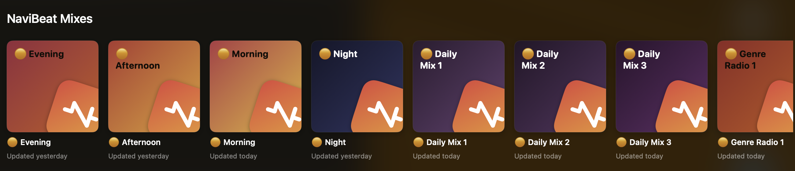
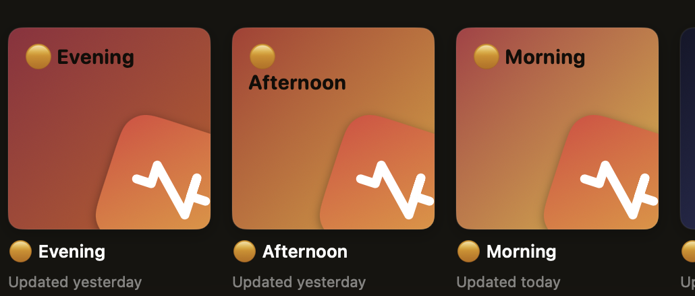
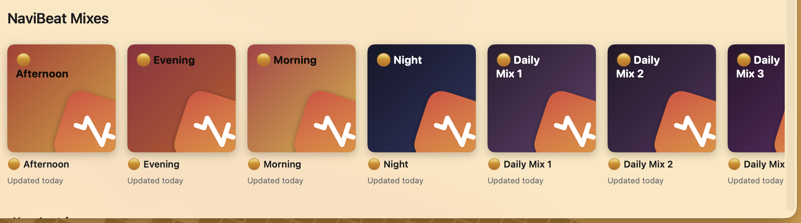
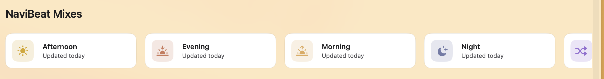
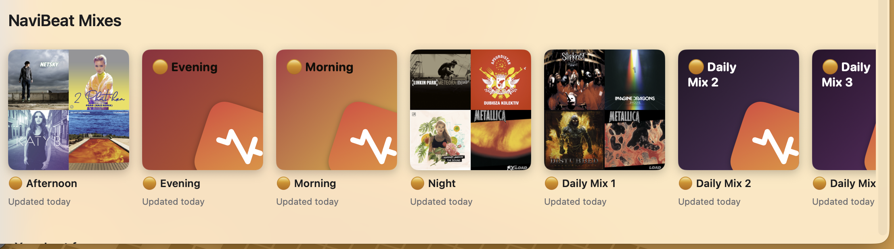

<p align="center">
  <a href="https://navibeat.app"></a>
</p>

<h1 align="center">NaviBeat Mixes</h1>

<p align="center">
  <a href="https://navibeat.app"><b>navibeat.app</b></a>
</p>

[](../../releases)
[](../../releases/latest)
[](https://www.navidrome.org)
[](LICENSE)

[](https://buymeacoffee.com/nenadjokic)
[](https://paypal.me/nenadjokicRS)

A Navidrome plugin that builds playlists from how you actually listen: a mix
for each part of the day, and a Rediscover mix of music you loved and have not
played in months.

It creates ordinary playlists through the Subsonic API, so they appear in
**every** client you use. The Navidrome web UI, Symfonium, Amperfy, play:Sub,
NaviBeat, anything else. Nothing to install on the client side.


## What you get

Up to 23 playlists, every one of them optional.

| Playlist | What is in it |
|---|---|
| Morning / Afternoon / Evening / Night | What you play in that part of the day |
| Rediscover | Music you loved and have left alone longest |
| New Music | The newest additions to your library, or the newest releases in it: your choice |
| Your Loved Songs | Everything you starred, oldest favourite first |
| On Repeat | What you have been playing over and over lately |
| Your Essentials | Your most played of all time |
| Weekly Discovery | Music you own, played once or twice, then forgot |
| Genre Radio 1 to 3 | Your strongest genres, ranked by what you play |
| Artist Radio 1 to 5 | Everything you have by each of your top artists |
| Daily Mix 1 to 3 | Built around a different anchor artist each |
| Decade mixes | Your strongest decades, for example 1990s |
| Wrapped 2026 | Your most played since the plugin was installed |

### The contents rotate weekly, the names do not

Artist Radio, Genre Radio, Daily Mix and the decade mixes draw from a pool far
deeper than they show: 20 artists behind 5 slots, 12 genres behind 3. Every
Monday the window moves, so you meet a different part of your own library
instead of the same top five forever.

The playlist you pinned is still that playlist. Only what is inside it changed.

### Playlist names never change

This matters more than it sounds. A playlist called "Artist Radio 1: LINKIN
PARK" gets a new name the day your listening shifts, which creates a **new**
playlist and orphans the old one. That is why servers running some playlist
plugins need a cleanup script on a cron.

Here the name is "Artist Radio 1" and the artist goes in the description. The
number is the identity, so the playlist you pinned last month is still the same
playlist today, whatever is inside it.

## Honest about what it knows

**Rediscover works the day you install it.** Navidrome already tracks what you
starred and when you last played each track, so there is nothing to wait for.

**The time-of-day mixes need a few weeks.** This is not a limitation anyone
chose. The Subsonic API exposes only a track's *last* play, never the
individual plays, so there is no way to ask a server what you listen to at
08:00. The plugin has to watch plays go past and build that picture itself.

**Navidrome's own listen history cannot shorten that wait yet.** Navidrome
0.59.0 and newer records every play in its own scrobbles table, but through
0.63.2 nothing exposes that table: not the Subsonic API, not the native API,
and not the services a plugin can call, so the plugin has no way to read it and
the same plays are remembered twice, once by Navidrome and once here. A host
service that hands a plugin exactly that history was merged into Navidrome's
development branch on 2026-08-09 (navidrome/navidrome PR #5795) and is in no
release yet; the first NaviBeat Mixes release after a Navidrome release ships
it will read the history from the server and start personal on day one.

Until it has enough (150 plays by default), the mixes are built from your most
played music instead, and **each playlist says so in its own description**:

> Morning mix. Still learning when you listen to what, so for now this is built
> from your most played music. It gets more personal over the next few weeks.

Once there is enough, the same playlist changes to:

> Morning mix, built from what you actually play at this time of day. Refreshes daily.

You never have to guess which one you are looking at.

## Privacy

Your listening history lives in Navidrome's own key-value store and is never
sent anywhere. Nothing leaves your machine unless you switch on Wrapped
sharing, which is **off by default**.

If you do switch it on, exactly one thing is sent, to `navibeat.app` and
nowhere else: your play total, distinct track count, top artist names and your
peak listening hour. Never a play log, never track ids, never your username,
and nothing that identifies your server. It is one short file you can read
before trusting it: [`internal/wrapped/share.go`](internal/wrapped/share.go),
and a test fails the build if any other field ever appears in that payload.

## Requirements

- Navidrome **0.63.1 or newer**, with plugins enabled
- Nothing else

## Install

1. Download `navibeat-mixes.ndp` from [the latest release](../../releases/latest).
2. Drop it into your Navidrome plugins folder.
3. Enable plugins in `navidrome.toml` if you have not already:

   ```toml
   [Plugins]
   Enabled = true
   ```

4. Restart Navidrome, then switch the plugin **on** in **Settings, Plugins**.

**There is no permission prompt, and nothing to tick one by one.** Navidrome
grants a plugin everything its manifest declares at the moment you enable it.
The permission list on the plugin's page is there so you can read what it will
be allowed to do before you switch it on: clicking one explains it, it does not
toggle it. This plugin asks for four:

| Permission | Why |
|---|---|
| `scheduler` | To refresh your mixes daily |
| `subsonicapi` | To read your library and create the playlists |
| `users` | Mixes are per user, and every Subsonic call needs a user |
| `kvstore` | To remember when you listen to what |

Your mixes appear within a minute of enabling it, and refresh at 04:00 daily.

> **If nothing appears after an upgrade:** Navidrome disables a plugin whenever
> its file changes, because the new version may declare different permissions.
> Switch it on again in Settings.

> **On a server you have not listened to yet, use 0.9.0 or newer.** Earlier
> versions gathered their candidate tracks only from your favourites and your
> most played and most recently played albums, and on a server installed this
> morning all three of those are empty, however large the library is. 0.9.0
> reads the newest albums as well, so a fresh install gets New Music, the genre
> radios and the decade mixes on day one, and the rest fill in as you listen.

> **To watch a run happen**, set `Plugins.LogLevel = "debug"` in
> `navidrome.toml` and filter the log for `plugin=navibeat-mixes`. Every run
> says what it did, including when it found nothing to work with.

## Configuration

**Everything is a form field in Navidrome's own plugin settings.** No config
files, no restart. Five groups:

| Group | What you can change |
|---|---|
| Playlists | The name prefix, which accounts get mixes, and how many tracks each mix holds |
| Which mixes to build | A switch per mix, so you can turn off any you do not want, and what New Music counts as new |
| Names | Rename any mix, so they can speak your language |
| Tuning | Rediscover age, how soon mixes become time-aware, genre filtering |
| Sharing | Wrapped sharing, off by default |

Every field has a default that works on a server nobody has touched, so you can
install it and never open the settings at all.

**If Rediscover comes out empty**, your listening is simply too current for it:
nothing you starred has gone six months untouched. Lower the Rediscover age to
2 or 3 months.

**A mix needs at least 10 tracks to be worth making**, so an account with very
little listening history gets no playlists rather than a four track one.

### What New Music counts as new

By default New Music ranks on the date a file **reached your server**, which
every Subsonic server sends for every song. On a library that is still being
ripped that is not always what you want: a 1984 record added yesterday is the
newest file on the server and the oldest music in the mix.

`newMusicOrder` (the "New Music: what counts as new" dropdown) has two values:

| Value | New Music ranks on |
|---|---|
| `added` | When the file reached your server. The default, and the only order before 0.9.8. |
| `released` | The release date in your tags, newest first. Tracks with no date at all fall back to the added date. |

In `released` order the date comes from the album's `originalReleaseDate`, then
its `releaseDate`, then its `year`, then the song's own `year`, so a 2015
remaster of a 1975 record stays a 1975 record. A year-only tag counts as
1 January of that year, so within one year an album tagged with a full date
ranks ahead of one tagged with only the year. Two tracks released the same day
are ordered by the added date, newest arrival first.

The pool also grows in this mode: the plugin fetches the albums released this
year and the two years before it on top of the usual lists, so this year's
records are in the mix whatever day they were added. That costs up to one
extra `getAlbum` call per album in that list, only for accounts with this
order set, and only while New Music is enabled.

A library with no dates in its tags comes out in exactly the added order, so
the setting can never make the mix worse than the default. Played tracks still
go behind unplayed ones in both orders.

### On a server with more than one account

**Mixes are per person.** Everyone who plays music gets their own set, built
from their own listening, and each set is private to its owner.

That is the right default for a server where everyone wants them, and the wrong
one for a server where one person does. Twenty playlists per account adds up,
and an account that never asked for this still gets them. So **"Build mixes only
for these accounts"** takes a comma separated list of usernames. Leave it empty
and everyone gets mixes, exactly as before. Fill it in and the accounts you
leave out get nothing, and cost nothing: a skipped account also skips the
roughly 300 Subsonic calls a run spends on it.

Play history is still collected for everyone, because it is cheap and it means
an account you add to the list later starts with real evidence instead of
warming up for weeks.

**One thing this cannot change:** Navidrome shows an admin every playlist on the
server, including other people's private ones. That is Navidrome's own rule, not
this plugin's, so an admin account will always see more playlists than a regular
one. Narrowing the list above is what shortens it.

### Why the genre threshold exists

Tagging tools sometimes write a single genre across an entire library. One real
collection had one genre on 15316 of its 15520 tracks. Selecting on a genre
like that is indistinguishable from selecting at random, so any genre covering
more than `genreNoiseThreshold` of your library is ignored as a signal. Your
files are never modified.

## Building from source

```bash
make          # produces navibeat-mixes.ndp
make test     # unit tests, run natively
```

Both toolchains work and the Makefile picks whichever you have. TinyGo is worth
installing, it more than halves the binary that ships to every user:

| Toolchain | Size |
|---|---|
| TinyGo | **1.5 MB** |
| Standard Go | 3.9 MB |

## Development

You need a scratch Navidrome. **Never point this at a server you care about.**

```bash
make          # build the .ndp
dev/up.sh     # throwaway Navidrome on port 4544, plugin installed and enabled
dev/verify.sh # assert the plugin loaded and did its job
```

Three things about the dev loop that are easy to lose an hour to:

1. **A discovered plugin is not an enabled plugin.** Navidrome writes it to the
   database with `enabled=0` and waits for you to approve its permissions.
2. **It disables itself again on every file change**, and the approval only
   sticks if you set it *after* the server has recorded the new file's hash.
   Approve after the restart, not before.
3. **Do database edits with `docker exec`, inside the container.** Editing the
   SQLite file from the host while the server has it open made the server
   report `database disk image is malformed`.

A fresh Navidrome has no listening history, so seed some:

```bash
docker exec -u root nd-dev sqlite3 /data/navidrome.db \
  "INSERT OR REPLACE INTO annotation (user_id, item_id, item_type, play_count, play_date, starred, starred_at)
   SELECT (select id from user limit 1), id, 'media_file', 6,
          datetime('now','-8 months'), 1, datetime('now','-8 months')
   FROM media_file ORDER BY id LIMIT 25;"
```

## How clients can recognise these playlists

A Navidrome plugin cannot serve HTTP, register a route, or draw any UI. The
only surface it has is the playlists it creates, so each description carries
the sentence a person reads, one line of attribution, and one machine line:

```
Morning mix, built from what you actually play at this time of day. Refreshes daily.
Made by NaviBeat  ·  navibeat.app
nb1:timeofday:morning:2026-07-28:affinity:30
```

Machine line fields, colon separated: schema version, kind, slot, generation
date, mode, track count.

Clients that know nothing about this show two short extra lines, which is
harmless. Clients that do understand it can hide the machine line and render
something richer.

The order is deliberate. `playlist.comment` is declared `varchar(255)` in the
schema and simply is not enforced today. If that ever changes, truncation eats
from the end, taking the machine tail first and leaving a description a person
can still read.

If you are writing a client: key your detection on the `nb1:` line, never on
the playlist name, because the prefix is user-configurable. Treat anything
malformed or truncated as "not mine" so you never restyle a playlist somebody
made by hand.

## What it looks like in NaviBeat

**This plugin is not a NaviBeat feature and it never became one.** It writes
ordinary playlists through the Subsonic API, so the Navidrome web UI, Symfonium,
Amperfy, play:Sub and anything else all see them, and nothing is installed on the
client side. That is the whole design and it is not going to change.

What NaviBeat does is **read the machine line described above** instead of
printing it. Same playlists, same server, one client that understands what it is
looking at.



That screenshot was taken at 20:29, which is the point of the first tile.

- **The mix for the current part of the day leads.** Evening is first in the
  evening, Morning is first in the morning. The shelf reorders itself rather than
  making you find the right one.
- **Each mix draws its own generated cover** instead of the four-square mosaic a
  client falls back to when a playlist has no artwork.
- **One line of state under each tile.** "Still learning you" while the server is
  still building that mix from raw popularity, and "Updated today" or "Updated
  yesterday" once it is running on your own listening. It is the only fact about
  a generated playlist worth a line.
- **The shelf does not exist unless the plugin does.** No empty rail, no promise
  of a feature you have not installed.



Every other client shows these playlists as rows with two extra lines of text
under them, which is harmless and was designed to be. If you write a client and
want the same, the format is documented above and you are welcome to it.

### You choose how they are drawn, here, not in the app

**Settings > Plugins > NaviBeat Mixes > How NaviBeat draws them.** The choice
lives here rather than in NaviBeat for a simple reason: a setting inside the app
for a feature that lives in a plugin is a dead switch for everyone who never
installed the plugin.

**`cover`** is the default and what every existing install already sees: one
generated cover per mix, stable from day to day.



**`button`** trades the artwork for width. The row becomes compact buttons with
an icon per mix, which is worth it when a shelf of six covers starts reading as
one thing repeated rather than six different mixes.



**`mosaic`** steps aside entirely and lets your server's own four-square album
grid through, the same artwork every other client draws. A playlist your server
has not built a mosaic for yet falls back to the generated cover until it has,
so the first minute after switching can look mixed.



When the style is `button`, **Button icons and colours** lets you set an icon and
a colour per mix family. Both are optional: leave them empty and each family gets
a sensible one, which is what the screenshot above shows.

> **Restart Navidrome after changing plugin settings.** The plugin reads its
> configuration when Navidrome loads it, so a change made in the settings form
> does not reach a running plugin. This is Navidrome's plugin lifecycle rather
> than anything this plugin decides, and it applies to every setting here, not
> just these.

## Support

This plugin is free and always will be. If it earns you a few good mornings:

[](https://buymeacoffee.com/nenadjokic)

[](https://paypal.me/nenadjokicRS)

## About NaviBeat

NaviBeat is a music player for your own Navidrome or OpenSubsonic server, on
iPhone, iPad, Mac, Apple TV, Apple Watch and Linux. This plugin is a separate,
free, open-source project that works with every client, not just that one.

[navibeat.app](https://navibeat.app)

## Licence

**GPL-3.0-or-later**, the same licence as Navidrome itself.

This is not a preference, it follows from how the plugin is built: it links
Navidrome's own Go plugin development kit into the compiled `plugin.wasm`, and
Navidrome is GPL-3.0. Distributing that binary therefore means distributing
GPL-3.0 code, so the whole plugin is GPL-3.0.

It also happens to be the right choice. It matches the project it extends, it
is the licence the self-hosted community expects, and it guarantees that anyone
who ships a modified version of this plugin has to publish their changes.

Nothing here restricts any music player that merely reads the playlists it
creates. Reading a playlist over the Subsonic API is two separate programs
talking over a network protocol, not a derived work.
